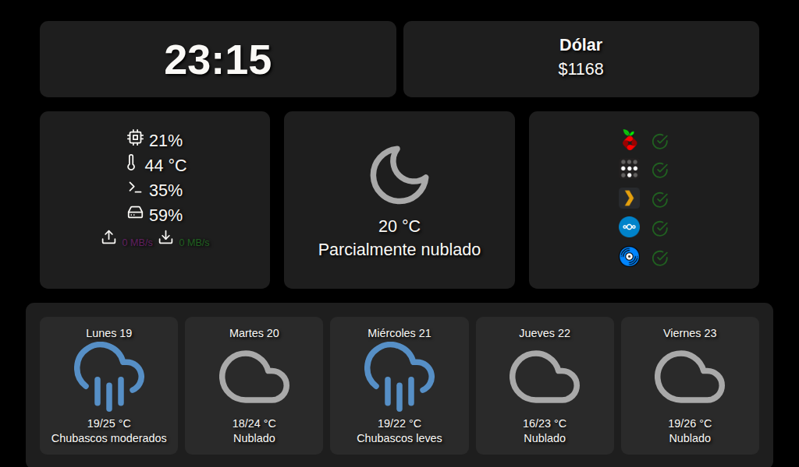

# 📊 Server Monitoring Interface (Debian 32-bit)

## ✨ Features

- 🖥️ **System Metrics Overview**
  - CPU usage and temperature
  - RAM and disk usage
  - Network upload/download speeds

- 🌤️ **Weather Integration**
  - Current conditions and 5-day forecast via Open-Meteo API
  - Interprets weather codes into meaningful icons and descriptions

- 💵 **Live Exchange Rate**
  - Real-time USD currency conversion display

- 📡 **Service Health Monitoring**
  - Checks and displays the status of:
    - Pi-hole
    - Plex Media Server
    - Tailscale
    - Nextcloud
    - Navidrome

- ⚙️ **Performance-Oriented Design**
  - Fully static HTML/CSS/JS with no frameworks
  - Minimal resource usage, ideal for low-spec hardware

## 🧠 How It Works

The interface relies on a custom PHP backend (`SystemStatus.php`) and a Bash script (`SystemStatus.sh`) to gather and serve live data from the server. Here's a breakdown of how each component works:

### 🖥️ System Metrics

The PHP script executes `SystemStatus.sh`, which:

- Calculates **CPU usage** using two samples from the `top` command.
- Retrieves **CPU temperature** via `lm-sensors`, formatted for display.
- Measures **network bandwidth** by comparing bytes sent/received from `/proc/net/dev` over a 1-second interval.

This data is passed back as a comma-separated string and parsed in PHP to JSON format.

### 🧠 Memory & Disk Usage

- **RAM usage** is calculated by reading `/proc/meminfo` and computing used memory as a percentage of the total.
- **Disk usage** is derived from `disk_total_space()` and `disk_free_space()` for the root partition, shown as a percentage.

### 🛰️ Service Monitoring

The system checks the **status of essential services** using two methods:

- `service <name> status` and string matching are used to determine if:
  - `pihole-FTL`, `tailscaled`, `plexmediaserver`, or `apache2` (Nextcloud) are running.
- `pgrep -x navidrome` is used to determine if Navidrome is active as it's not managed by a typical service unit.

Each service is reported as `"Activo"` or `"Inactivo"` and displayed with visual indicators in the frontend.

### 🌐 Frontend Data Handling

The data is exposed as a JSON object, which is periodically fetched by the JavaScript frontend. The page updates in real-time without reloads, providing a seamless monitoring experience.

---

This modular approach ensures flexibility, low resource usage, and compatibility with legacy hardware.

## 💡 Why It’s Useful

Designed for low-powered machines, this web-based control panel provides:

- A clear and instant overview of system performance
- Fast identification of service outages or abnormal behavior
- Weather and currency information at a glance
- A modular and easily extensible codebase
- Clean, icon-based UI optimized for small displays
- Hassle-free operation with no dependencies

## 📸 Screenshot

  

## 🤝 Contributions

Contributions are welcome! Feel free to open an issue or submit a pull request with improvements, feature suggestions, or bug fixes.
